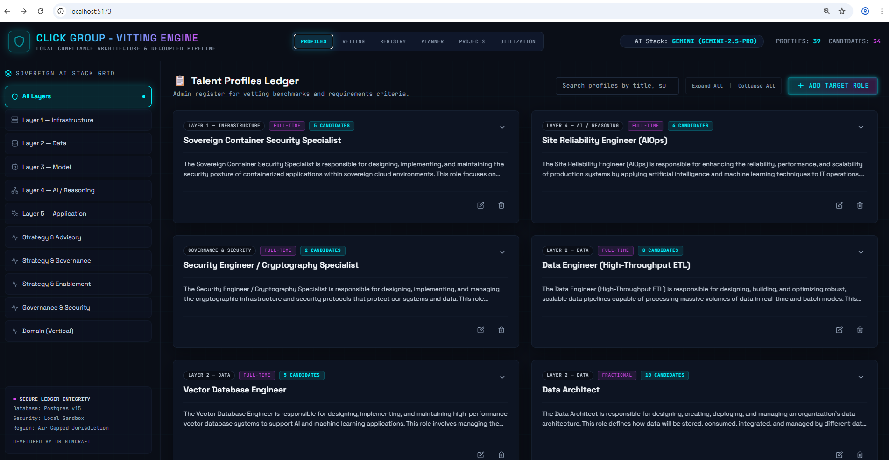
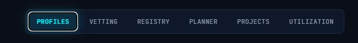
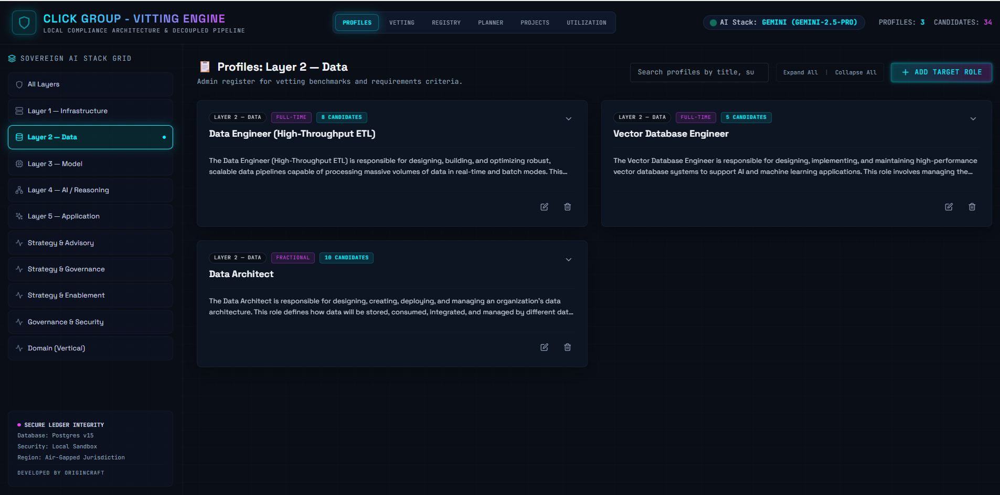
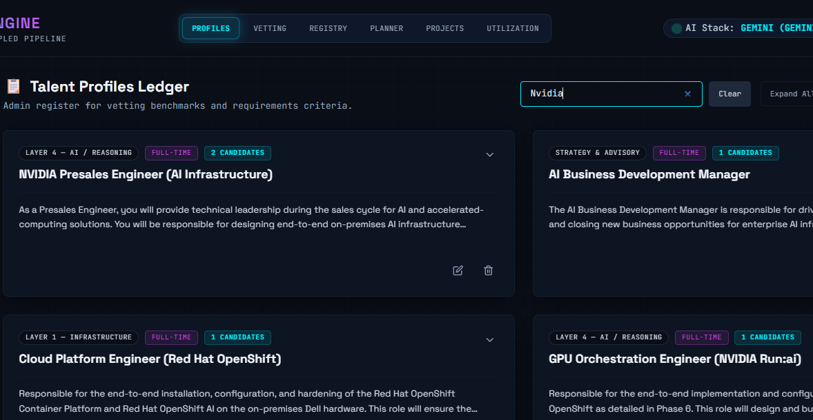
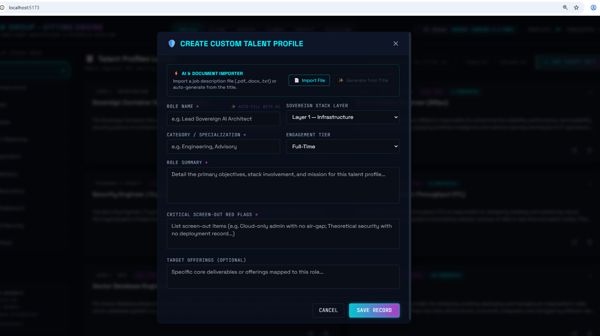
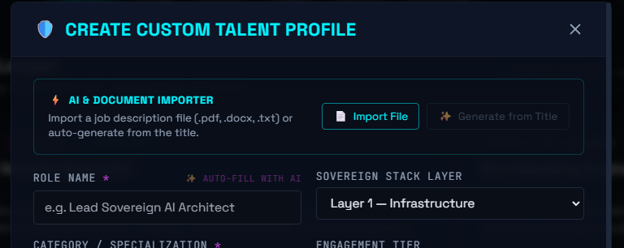

# Sovereign Talent Engine — User Guide

> **How to add screenshots:** Take a screenshot of each feature described below, save it to the `docs/screenshots/` folder using the exact filename shown under each placeholder, and the image will appear automatically in this guide.

---

## Table of Contents

1. [Accessing the Platform](#1-accessing-the-platform)
2. [Navigation](#2-navigation)
3. [Profiles Tab — Talent Benchmark Library](#3-profiles-tab--talent-benchmark-library)
4. [Vetting Tab — AI Candidate Assessment](#4-vetting-tab--ai-candidate-assessment)
5. [Candidates Tab — Candidate Ledger](#5-candidates-tab--candidate-ledger)
6. [SOW Planner Tab — Project Scope Analysis](#6-sow-planner-tab--project-scope-analysis)
7. [Projects Registry Tab](#7-projects-registry-tab)
8. [Utilization Tab — Resource Tracking](#8-utilization-tab--resource-tracking)
9. [Assigning a Candidate — Calendar Picker](#9-assigning-a-candidate--calendar-picker)
10. [Candidate Dossier](#10-candidate-dossier)
11. [Click Nexus Applicant Tracking System](#11-click-nexus-applicant-tracking-system)

---

## 1. Accessing the Platform

Start all services with Docker Compose (remembering to start both the core Click-Vitting composition and the Click-Nexus composition):

```bash
# 1. Start Core Vitting Engine & Auth services
docker compose up --build -d

# 2. Start Click Nexus ATS gateway services
docker compose -f click-nexus/docker-compose.yml up --build -d
```

Then open your browser and go to the **Central Auth Portal** at:

| Service | URL | Role Access |
|---|---|---|
| **Central Auth Portal** | http://localhost:5175 | All Users (Sign-in / Sign-up) |
| **Vitting Engine Dashboard** | http://localhost:5173 | Admins, HR, Project Managers |
| **Click Nexus ATS Portal** | http://localhost:5174 | Admins, Applicants |
| **API Docs (Core)** | http://localhost:8000/docs | Developer reference |

### Role-Based Access Redirection
When you log in through the portal, the system automatically redirects you:
- **Applicants** are sent directly to the Click Nexus ATS portal.
- **HR & Project Managers** are sent directly to the Vitting Engine dashboard.
- **Admins** are presented with a central selector page to choose which workspace to enter.

Sessions require a valid JWT token. Unauthorized navigation directly to the dashboard URLs will redirect back to the login page.


> *The central auth page routes authenticated sessions to their designated applications.*

---

## 2. Navigation

The six main sections of the platform are accessed via the top navigation bar.


> *Navigation bar showing all six tabs: Profiles, Vetting, Candidates, SOW Planner, Projects, Utilization.*

| Tab | Purpose |
|---|---|
| **Profiles** | Manage the talent benchmark library |
| **Vetting** | Run AI-powered candidate assessments |
| **Candidates** | Browse and manage the candidate ledger |
| **SOW Planner** | Analyse project scope and plan resources |
| **Projects** | View and manage saved SOW projects |
| **Utilization** | Track resource utilisation and timelines |

---

## 3. Profiles Tab — Talent Benchmark Library

### Overview


> *The Profiles tab lists all talent benchmark profiles grouped by stack layer.*

### Filtering by Stack Layer

Use the layer filter buttons at the top to narrow down profiles by category (Infrastructure, Data, Model, AI/Reasoning, Application, Strategy, Governance, Domain).


> *Filtering profiles to show only Layer 2 — Data roles.*

### Creating a Profile Manually

Click **+ New Profile** to open the profile form. Fill in the role name, stack layer, category, engagement tier, role summary, and red flags.


> *The profile creation modal with all required fields.*

### Importing a Profile from a Job Description File

Click **Import from File** and upload a PDF, DOCX, or TXT job description. The AI reads the document and extracts a structured talent profile automatically.


> *Uploading a job description file — the AI extracts role details and pre-fills the form.*

### Generating a Profile from a Job Title

Click **Generate from Title**, type any job title, and click Generate. The AI creates a complete profile definition from scratch.


> *Typing "Prompt Engineer" and generating a full AI-defined profile.*

### Editing or Deleting a Profile

Hover over any profile card to reveal the **Edit** and **Delete** buttons.


> *Edit and Delete actions on a profile card.*

---

## 4. Vetting Tab — AI Candidate Assessment

### Selecting Profiles to Assess Against

In the left panel, select one or more talent profiles from the library. These define the benchmark the candidates will be scored against.


> *Selecting two profiles to use as the assessment benchmark.*

### Selecting Candidates

In the right panel, select the candidates to assess. Candidates already assessed against the selected profiles show their previous score.


> *Selecting candidates from the ledger for assessment.*

### Running the Assessment

Click **Run Assessment**. A live progress log streams the AI's work in real time over WebSocket. When complete, results appear inline.


> *Live assessment progress log streaming from the backend.*


> *Completed assessment showing match score, skills matched, gaps, red flags, and AI verdict.*

### Disqualifying a Result

Click the **Disqualify** button on any assessment result to exclude it from the candidate's scoring summary. Click again to reinstate.


> *Disqualified assessments are visually marked and excluded from the candidate's top score.*

---

## 5. Candidates Tab — Candidate Ledger

### Ledger Overview


> *The full candidate ledger with match scores, skills, and assignment status badges.*

### Adding a Candidate via CV Upload

Click **Upload CV**, select a PDF or DOCX resume file, and click Upload. The system enqueues a background parsing task and streams progress. When complete, a new candidate record appears in the ledger.


> *Uploading a CV — live progress log streams the extraction.*

### Adding a Candidate via LinkedIn Scan

Click **LinkedIn Scan**, paste a LinkedIn profile URL, and click Scan. A mock scraping pipeline generates a candidate record from the URL.


> *LinkedIn scan workflow — the pipeline simulates profile scraping.*

### Creating a Candidate Manually

Click **+ New Candidate** and fill in the form: full name, email, contact number, LinkedIn URL, skills, experience years, and notes.


> *The manual candidate creation form.*

### "New Candidate" Status Badge & Left Sidebar Filter Toggle

All candidate dossiers ingested via the Click Nexus ATS gateway are initialized with a prominent yellow `"New Candidate"` status tag on their cards in the Registry ledger.
- **Filtering New Candidates**: In the Left Panel Sidebar under "Registry Filters", click the **New Candidates** button to toggle the list to show only new, unvetted candidates. Click it again to disable the filter and return to the default list.
- **Tag Removal Lifecyle**: The yellow badge is automatically cleared when the candidate is manually vetted (by executing a matchmaking assessment), blacklisted, or deleted.

### Searching Candidates

Use the search bar at the top of the ledger to filter candidates by name in real time.


> *Filtering the ledger by typing a name.*

### Blacklisting a Candidate

Click the **Blacklist** toggle on a candidate card to flag the candidate as ineligible. Blacklisted candidates are visually marked and excluded from assignment flows.


> *A blacklisted candidate card with the warning indicator.*

---

## 6. SOW Planner Tab — Project Scope Analysis

### Pasting or Uploading an SOW

Either paste raw SOW text into the text area or click **Upload SOW File** to upload a PDF or DOCX document.


> *Pasting SOW text into the planner input area.*

### Running the Analysis

Click **Analyse Scope**. The AI reads the SOW and returns two lists:

- **Matched Profiles** — existing library profiles that are relevant to the project.
- **Identified Missing Gaps** — required roles that are not yet in the profile library, with AI-generated profile definitions.


> *Analysis results: matched profiles on the left, missing gaps on the right.*

### Promoting a Missing Gap to the Library

Click **Add to Library** on any missing gap profile to promote it directly into the profile library. Once promoted, it becomes available for candidate matching.


> *Promoting a missing gap profile into the talent library.*

### Assigning Candidates to Roles

Each matched or promoted profile card shows the top-scored candidates from the ledger. Click **Assign** next to a candidate to open the calendar assignment modal.


> *Assigning a candidate to a matched profile from within the SOW Planner.*

### Multiple Time Slots per Candidate

A candidate assigned to more than one slot shows each slot inline with its own date range and **Release** button. Click **+ Slot** to add another non-overlapping assignment slot.


> *A candidate with two assignment slots visible in the planner view.*

### Saving a Project

Click **Save as Project**, enter a project name, and click Save. The SOW analysis and all assignments are saved to the Projects Registry.


> *Saving the current SOW workspace as a named project.*

### Loading a Previously Saved Project

Click **Load Project**, select a project from the list, and click Load. The planner workspace is restored with the saved profiles and assignments.


> *Loading a saved project back into the SOW Planner.*

---

## 7. Projects Registry Tab

### Project Cards Overview


> *The Projects Registry showing all saved SOW projects with key metrics.*

Each project card shows:
- Project name and creation date
- Number of matched roles
- Number of missing gaps
- Number of assigned resources

### Project Detail View

Click on a project card to open the detail view. This shows all profiles grouped by role, with each assigned candidate listed under their role along with slot dates, duration, and status.


> *Project detail: role-grouped allocation view with assigned candidates per slot.*

### Releasing a Candidate from a Project

Click **Release** next to any assignment slot to remove that specific slot. The candidate remains in the ledger and can be reassigned.


> *Releasing a single assignment slot from a project role.*

---

## 8. Utilization Tab — Resource Tracking

### KPI Summary Cards

The top of the Utilization tab shows six summary metrics at a glance.


> *KPI cards: Total Candidates, Active, Upcoming, Past, Unscheduled, Available.*

### Project Coverage Bars

Each saved project shows a coverage bar indicating how many of its required roles have been filled.


> *Project coverage bars showing filled vs. required roles per project.*

### Resource Timeline (Gantt Chart)

The Gantt chart shows all scheduled assignment slots across a shared timeline. Each candidate occupies one row; multiple slots for the same candidate appear as separate bars on the same row.

- **Cyan** — active assignment (currently running)
- **Blue** — upcoming assignment (in the future)
- **Slate** — past assignment (ended)


> *Gantt chart: consolidated one-row-per-candidate timeline with multiple slot bars.*

### All Assignments — Accordion Table

The All Assignments table groups every candidate into a single collapsible row. The header shows the candidate's name, number of slots, overall date span, and dominant status.

Click any row to expand it and see the individual slot details: project, role, start date, end date, duration, status badge, and a Release button per slot.


> *Collapsed view — one row per candidate with slot count and status.*


> *Expanded view — individual slot rows visible under the candidate header.*

### Available for Assignment

The bottom panel lists all candidates who have no current assignments and are ready to be placed.


> *Candidates with no active assignments, ready to be assigned.*

---

## 9. Assigning a Candidate — Calendar Picker

When you click **Assign** for a candidate in the Planner or Projects view, a calendar modal opens.


> *The Assign Candidate modal showing the interactive calendar.*

### Reading the Calendar

| Visual | Meaning |
|---|---|
| Cyan filled cell | Selected start or end date |
| Cyan tinted cells | Selected date range |
| Magenta dimmed cells | Busy — already assigned in another slot |
| Magenta dot at bottom | Busy day indicator |
| Cyan dot at bottom | Today |
| Greyed out cells | Days from adjacent months (not selectable) |


> *Busy days (existing assignment slots) shown in magenta — these cannot be selected.*

### Picking a Date Range

1. Click any available day to set the **start date** (highlighted cyan).
2. Hover across the calendar to preview the range live.
3. Click the end day to confirm the **end date**. If the range would cross a busy period, the end date auto-clamps to just before the conflict.


> *Hovering over the calendar shows a live preview of the selected range.*

### Navigating Months

Use the **‹** and **›** arrows to move between months.

### Clearing the Selection

Click **Clear selection** below the calendar to reset and start over.

### Assigning Without Dates

Dates are optional. Click **Confirm Assign** without selecting any dates to create an unscheduled assignment slot that can have dates added later.

---

## 10. Candidate Dossier

Click the **Dossier** button on any candidate card to open the full candidate profile.


> *The Candidate Dossier showing all assessments, scores, and profile details.*

The dossier includes:

- Candidate details (name, email, contact, LinkedIn, notes, experience, skills)
- Assessment ring visualisations — animated SVG rings showing match score per profile
- Per-profile breakdown: matched skills, skill gaps, red flags, and the full AI written verdict
- Disqualify / reinstate toggle per assessment
- Current assignment slots


> *Assessment rings showing match scores across multiple profiles.*


> *AI-generated verdict for a specific profile assessment.*

---

## 11. Click Nexus Applicant Tracking System

The Click Nexus gateway (port 5174) serves as the candidate-facing application intake.

### Applying to a Job
1. Log in to the Central Auth Portal (port 5175) using the **Applicant** role credentials.
2. Select an open job posting from the dashboard list.
3. Click the **Apply Now** button to launch the application wizard.
4. Fill in all mandatory candidate parameters:
   - Full Name
   - Email Address
   - Secure Contact Number
   - LinkedIn Profile URL
   - Country of Residence
   - Nationality
5. Upload a resume file (PDF or DOCX format).
6. Click **Submit Application**.

### Form Data Integrity
The application form details are protected against AI parser errors. The platform's CV parser runs strictly in the background to extract capabilities (`skills`) and store the raw text payload, without overwriting the applicant's input parameters.

---

## Screenshot Checklist

Use this checklist to track which screenshots still need to be taken and placed in `docs/screenshots/`.

| File | Section | Status |
|---|---|---|
| `01-landing.png` | Platform landing page | [ ] |
| `02-navigation.png` | Top navigation bar | [ ] |
| `03-profiles-overview.png` | Profiles tab overview | [ ] |
| `03-profiles-filter.png` | Stack layer filter | [ ] |
| `03-profiles-create.png` | Create profile modal | [ ] |
| `03-profiles-import.png` | Import from file | [ ] |
| `03-profiles-generate.png` | Generate from title | [ ] |
| `03-profiles-edit.png` | Edit/delete profile | [ ] |
| `04-vetting-profiles.png` | Vetting profile selection | [ ] |
| `04-vetting-candidates.png` | Vetting candidate selection | [ ] |
| `04-vetting-progress.png` | Live assessment progress | [ ] |
| `04-vetting-results.png` | Assessment results | [ ] |
| `04-vetting-disqualify.png` | Disqualify result | [ ] |
| `05-candidates-overview.png` | Candidates ledger | [ ] |
| `05-candidates-upload.png` | CV upload | [ ] |
| `05-candidates-linkedin.png` | LinkedIn scan | [ ] |
| `05-candidates-manual.png` | Manual creation form | [ ] |
| `05-candidates-search.png` | Candidate search | [ ] |
| `05-candidates-blacklist.png` | Blacklisted candidate | [ ] |
| `06-planner-input.png` | SOW input | [ ] |
| `06-planner-results.png` | Analysis results | [ ] |
| `06-planner-promote.png` | Promote gap to library | [ ] |
| `06-planner-assign.png` | Assign from planner | [ ] |
| `06-planner-slots.png` | Multiple time slots | [ ] |
| `06-planner-save.png` | Save project | [ ] |
| `06-planner-load.png` | Load project | [ ] |
| `07-projects-overview.png` | Projects registry | [ ] |
| `07-projects-detail.png` | Project detail view | [ ] |
| `07-projects-release.png` | Release assignment | [ ] |
| `08-util-kpis.png` | KPI cards | [ ] |
| `08-util-coverage.png` | Coverage bars | [ ] |
| `08-util-gantt.png` | Gantt chart | [ ] |
| `08-util-table-collapsed.png` | Assignments collapsed | [ ] |
| `08-util-table-expanded.png` | Assignments expanded | [ ] |
| `08-util-available.png` | Available candidates | [ ] |
| `09-calendar-overview.png` | Calendar picker | [ ] |
| `09-calendar-busy.png` | Busy days on calendar | [ ] |
| `09-calendar-range.png` | Range selection preview | [ ] |
| `10-dossier-overview.png` | Dossier overview | [ ] |
| `10-dossier-rings.png` | Assessment rings | [ ] |
| `10-dossier-verdict.png` | AI verdict | [ ] |
